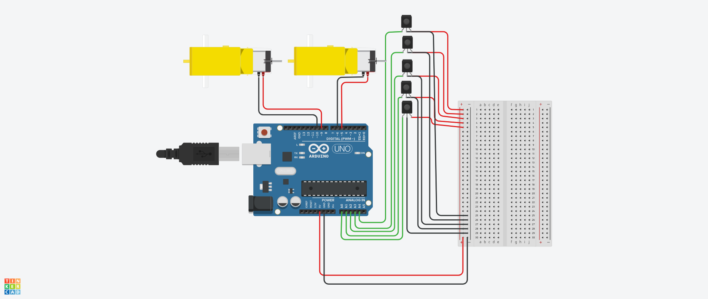

# Line Following Robot
A simple **Arduino-based line follower robot** that uses a **5 IR sensor array** and **PID (Proportional–Integral–Derivative) control** to follow a black line on a white surface (or vice versa) with smooth and accurate motion.
---
## Project Overview

This project implements a **PID controller** to adjust the speeds of two DC motors based on the position of the line under the robot.  
The robot uses a **5-sensor IR array** to detect the line’s position and computes the **centroid** of the active sensors to estimate its deviation from the center.

---
## Components Used

| Component | Quantity | Description |
|------------|-----------|-------------|
| Arduino Uno | 1 | Main controller board |
| IR Sensors | 5 | Digital IR sensor module |
| DC Motors | 2 | For left and right wheels |
| Chassis | 1 | Robot body frame |
| Wheels | 2 | Attached to DC motors |
| Battery Pack | 1 | Power source (7.4V–12V recommended) |
| Connecting Wires | — | Jumper wires and connectors |

---
## Working Principle

1. The **IR sensors** detect the line by reading high or low values (depending on color contrast).  
2. The readings are converted into a **position value** using a **weighted average (centroid method)**.  
3. The **PID algorithm** calculates how far the robot has deviated from the center:
   - **P (Proportional):** Corrects based on current error.
   - **I (Integral):** Corrects accumulated past errors.
   - **D (Derivative):** Corrects based on the rate of change.
4. The output from PID adjusts the **left and right motor speeds** to keep the robot on track.

---
## PID Equation
- **Kp** → Proportional gain (responsiveness)  
- **Ki** → Integral gain (drift correction)  
- **Kd** → Derivative gain (stability / damping)  
Output = (Kp × Error) + (Ki × ∑Error) + (Kd × ΔError)
Tuning these constants is key to smooth line following.

---
## Circuit Diagram

---
## Arduino Pin Configuration

| Signal | Pin | Type |
|---------|-----|------|
| Left-most sensor | A0 | Input |
| Left sensor | A1 | Input |
| Center sensor | A2 | Input |
| Right sensor | A3 | Input |
| Right-most sensor | A4 | Input |
| Left Motor (PWM 1) | 9 | Output |
| Left Motor (PWM 2) | 10 | Output |
| Right Motor (PWM 1) | 5 | Output |
| Right Motor (PWM 2) | 6 | Output |

---

## Code Explanation

- **Sensor Reading:**  
  Reads all 5 IR sensors using `digitalRead()`.  
- **Position Calculation:**  
  Uses centroid formula to find line position:
  pos = (Σ(sensor_value × weight)) / (Σ(sensor_value))
- **PID Computation:**  
Calculates error = (desired_center - current_position)  
Then applies Kp, Ki, Kd corrections.  
- **Motor Control:**  
Adjusts motor PWM speeds:
left_motor = base_speed - pid_output
right_motor = base_speed + pid_output

---

## PID Tuning Tips

1. Start with **Ki = 0**, **Kd = 0**, and increase **Kp** until the robot starts oscillating.  
2. Then increase **Kd** to reduce oscillation.  
3. Add a small **Ki** only if the robot drifts off the line slowly.  
4. Typical ranges:
 - `Kp = 0.001–0.01`
 - `Ki = 0–0.001`
 - `Kd = 0.001–0.01`

---

## Behavior

- When on the line: both motors move forward at base speed.  
- If robot veers right: left motor speeds up, right motor slows down.  
- If robot veers left: right motor speeds up, left motor slows down.  
- If line is lost: robot assumes center and keeps moving until detected again.

---

## Future Improvements
- Add **encoders** for speed feedback and precision turns.  
- Use **analog sensors** for smoother centroid detection.  
- Add **OLED or Serial Monitor** for real-time PID debugging.

---
## License

This project is open-source and free for educational and personal use.

---

## Author

**Reman Dey**  
An engineering student exploring embedded systems, robotics, and AI.  
This project was developed as a hands-on way to understand **PID control** and real-world feedback systems.  

> “Learning by building — that’s how control theory becomes intuition.”  

🌐 [GitHub](https://github.com/RemanDey) • [LinkedIn](https://linkedin.com/in/remandey) • [Website](https://remandey.github.io/my-portfolio/)  
📫 Reach me at: <reman.airport@gmail.com>

---
